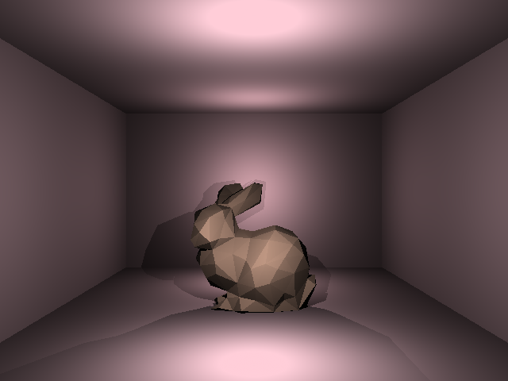
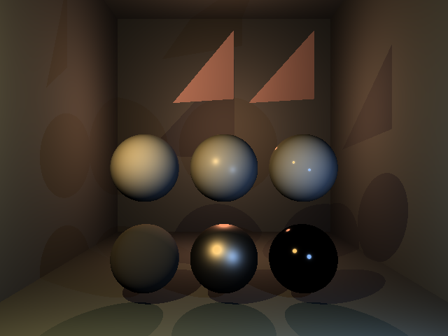

# Raytracer

This is a functional C++ implementation of the raytracing rendering method, built using the SDL framework.

It supports multiple scenes with moving cameras, PBR materials, and 3 basic light structures (point, linear and spot). Mesh importing is included, but several simple shape prefabs are offered as well.

 
 

 

